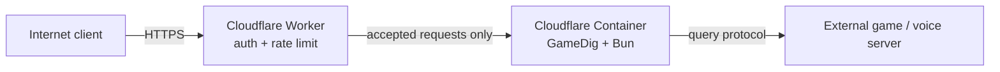

# cf-gamedig

Run [GameDig](https://github.com/gamedig/node-gamedig) behind a Cloudflare Worker and Cloudflare Container.

`cf-gamedig-container` exposes a small HTTP API for querying remote game servers with GameDig. The Worker is the public edge entrypoint; it authenticates and rate-limits query traffic before forwarding accepted requests to a Cloudflare Container, where Bun and GameDig can use the network protocols required by game-server query implementations.

## Overview

GameDig needs capabilities such as UDP, TCP, DNS, and protocol-specific HTTP requests that are not a good fit for running directly inside a Worker. This project keeps the public HTTP edge in a Cloudflare Worker and runs GameDig inside a Cloudflare Container with outbound internet access.

The service currently provides:

- `GET /health` for liveness checks
- `GET /query` for ordinary non-secret GameDig queries
- `POST /query` for JSON queries, including credential-bearing protocol options
- optional Worker Bearer-token authentication, with deliberately open mode as the default
- Worker-side `/query` rate limiting before the Container is contacted
- explicit POST-body and string-field size limits
- configurable `open` and `public-safe` target-policy modes
- runtime validation against the installed GameDig game and protocol registries
- GameDig-style port resolution when `port` is omitted
- a typed, normalized response envelope with protocol-specific data preserved under `raw`
- bounded retries and timeouts suitable for a public HTTP wrapper

The application itself can run entirely on Cloudflare. The game server being queried remains an external target and does not need to be hosted on Cloudflare.

## Architecture

```mermaid
flowchart LR
    Client["API client"]
    Worker["Cloudflare Worker<br/>routes + auth + rate limit"]
    Binding["Container binding<br/>getContainer(...)"]
    Container["Cloudflare Container<br/>Bun HTTP server"]
    GameDig["GameDig 5.3.3"]
    GameServer["Remote game server"]

    Client -->|HTTPS| Worker
    Worker -->|accepted requests only| Binding
    Binding -->|internal HTTP| Container
    Container --> GameDig
    GameDig -->|UDP / TCP / HTTP / DNS as required| GameServer
```



The Worker only accepts the public routes documented below. `/query` requests are authenticated when Worker authentication is enabled and are always checked against the configured Cloudflare Rate Limiting binding before `getContainer(...)` is called. The `Authorization` header is stripped before any accepted request is forwarded. `/health` stays unauthenticated and is not rate-limited.

The `GameDigContainer` listens on port `8080`, has outbound internet access enabled, and is addressed by the stable container key `cf-gamedig`.

Alchemy provisions the Worker and Container from `alchemy.run.ts`. The current stack uses a `lite` Container, starts with zero instances, allows at most one Cloudflare instance, enables observability, and lets the Container sleep after one minute of inactivity.

## Features

| Area | Current behaviour |
| --- | --- |
| GameDig runtime | Pinned to `gamedig@5.3.3` |
| Game IDs | Validated from GameDig's exported `games` registry |
| Legacy IDs | Supported only when `checkOldIDs=true` |
| Protocol forcing | Supports installed `protocol-*` IDs such as `protocol-valve` |
| Query ports | `port` is optional; GameDig can apply game defaults, `port_query`, and `port_query_offset` |
| Generic options | Typed, allow-listed GET and POST support |
| Protocol options | Typed support for the protocol-specific options listed below |
| Protocol credentials | Sensitive GameDig values are rejected in GET URLs and accepted through POST JSON |
| Request limits | 16 KiB POST body plus explicit limits for host, address, type, protocol strings, and credentials |
| Target policy | `open` by default; optional `public-safe` rejection of non-public IP literals before GameDig networking |
| Worker authentication | Optional Bearer token from a redacted deployment secret; unset means open mode |
| Worker rate limiting | Cloudflare Rate Limiting on `/query`, `10` requests per `60` seconds per stable client identity |
| Response | Stable GameDig result fields plus `players[].raw`, `bots[].raw`, and `server.raw` |
| Port cache | Disabled intentionally for every request |
| Runtime model | Cloudflare Worker in front of a Cloudflare Container |

## API

Use the deployed Worker URL as the base URL in the examples below:

```text
https://<deployment>
```

By default, `CF_GAMEDIG_AUTH_TOKEN` is unset and `/query` is deliberately open. If that deployment secret is configured, every `GET /query` and `POST /query` request must send the matching Bearer token. `/health` never requires the token.

### Routes

| Method | Route | Purpose | Worker auth | Rate limited |
| --- | --- | --- | --- | --- |
| `GET` | `/health` | Return a liveness response from the Container service. | No | No |
| `GET` | `/query` | Query a server using URL parameters. Sensitive options are not allowed. | When enabled | Yes |
| `POST` | `/query` | Query a server using a JSON body. Use this form when credentials are required. | When enabled | Yes |

Other public routes or methods are rejected by the Worker.

### `GET /health`

Request:

```bash
curl "https://<deployment>/health"
```

Response:

```json
{
  "service": "cf-gamedig-container",
  "success": true
}
```

### Worker authentication

Authentication is optional and disabled by default. The Worker reads `CF_GAMEDIG_AUTH_TOKEN` through Alchemy's redacted configuration support. No token is committed to this repository, and the empty default means the deployment remains deliberately open until a non-empty secret is supplied.

When authentication is enabled, use the standard `Authorization` header:

```text
Authorization: Bearer <api-token>
```

Missing, malformed, or incorrect credentials return a stable `401 Unauthorized` JSON response with `Cache-Control: no-store`. The Worker never forwards `Authorization` to the Container, and the configured token is not included in errors or responses.

### Worker rate limiting

`/query` uses Cloudflare Workers Rate Limiting before the Container binding is accessed. The current Alchemy configuration is explicit:

- binding: `QUERY_RATE_LIMIT`
- namespace ID: `31001`
- limit: `10` requests
- period: `60` seconds
- authenticated partition: SHA-256-derived token identity, never the raw token
- open-mode partition: `CF-Connecting-IP`, with a stable fallback when that header is unavailable

The limit is intentionally conservative because the current Container resource has `maxInstances: 1`. `/health` is exempt.

Blocked requests return stable JSON `429 RateLimited` responses with `Cache-Control: no-store` before `getContainer(...)` can wake or contact the Container. Cloudflare's current Rate Limiting binding returns only whether a request succeeded, so this service does not invent a `Retry-After` value.

If `/query` expects the rate-limit binding but the binding is missing or throws, the Worker fails closed with stable JSON `503 RateLimitUnavailable` rather than forwarding the request without abuse protection.

### Core query fields

`type` and `host` are always required. `port` is optional.

| Field | GET | POST | Required | Type | Description |
| --- | --- | --- | --- | --- | --- |
| `type` | query parameter | top level | Yes | string | Current GameDig game ID, permitted legacy ID, or installed `protocol-*` ID. Surrounding whitespace is trimmed. Maximum 128 characters. |
| `host` | query parameter | top level | Yes | string | Logical hostname or IP passed to GameDig. Must be non-empty. Maximum 253 characters. |
| `port` | query parameter | top level | No | integer `1`–`65535` | Supplied game/query port. When omitted, GameDig may resolve a default/query/offset port from game metadata. |

### `GET /query`

GET is intended for ordinary, non-secret queries.

```bash
curl "https://<deployment>/query?type=counterstrike2&host=103.212.227.45&port=27015"
```

URL values are parsed through an allow-list. Unknown query-string parameters are ignored rather than forwarded to GameDig.

GET booleans are strict lowercase strings: only `true` and `false` are accepted. Values such as `1`, `0`, `yes`, `on`, and `TRUE` fail validation.

Sensitive options are rejected even if the rest of the request is valid:

- `apiKey`
- `password`
- `telnetPassword`
- `token`

Use `POST /query` for those fields.

### `POST /query`

POST requests must use `Content-Type: application/json`. The complete request body is limited to 16 KiB (16,384 bytes). The Container checks both a declared `Content-Length` when present and the actual streamed byte count so an oversized body is rejected before it is fully buffered or JSON-decoded.

Core identity fields stay at the top level. GameDig options belong under `options`:

```json
{
  "type": "palworld",
  "host": "example.com",
  "port": 8212,
  "options": {
    "username": "admin",
    "password": "TEST_PASSWORD"
  }
}
```

POST uses natural JSON types: booleans are booleans and numbers are numbers. Unknown object properties are not forwarded into GameDig.

Malformed JSON returns `400`. Missing or unsupported content types return `415`. A body larger than 16 KiB returns stable `413 PayloadTooLarge` JSON. All Container JSON responses use `Cache-Control: no-store`.

### Request limits

The HTTP wrapper applies named limits before GameDig is called:

| Input | Limit | Oversize behaviour |
| --- | --- | --- |
| Complete `POST /query` body | 16 KiB / 16,384 bytes | `413 PayloadTooLarge` |
| `host` | 253 characters | `400 InvalidQuery` |
| `address` | 253 characters | `400 InvalidQuery` |
| `type` | 128 characters | `400 InvalidQuery` |
| Protocol-specific non-secret strings | 512 characters | `400 InvalidQuery` |
| Credential-bearing values | 4096 characters | `400 InvalidQuery` |

The 512-character protocol-string limit currently applies to `accountId`, `guildId`, `login`, `serverId`, and `username`. The 4096-character credential limit applies to `apiKey`, `password`, `telnetPassword`, and `token`.

Credential validation errors intentionally do not include the supplied value. Invalid POST objects use the stable `Invalid POST /query body` response rather than serializing the schema failure, so oversized or malformed credentials are not echoed back to the caller.

### Target policy

The Container has two target-policy modes controlled by `CF_GAMEDIG_TARGET_POLICY`:

| Mode | Default | Behaviour |
| --- | --- | --- |
| `open` | **Yes** | Preserves existing self-host/private-network behaviour. Private, loopback, link-local, and other destinations are not rejected by this policy. |
| `public-safe` | No | Rejects clearly non-public IPv4 and IPv6 **literals** in both logical `host` and connection `address` before the GameDig query runs. |

`public-safe` rejects literal destinations from categories such as loopback, private/unique-local, link-local, carrier-grade NAT, benchmarking/documentation, multicast, unspecified, and reserved/special-use ranges. IPv6 acceptance is deliberately conservative: ordinary global-unicast literals are accepted while clearly special-use ranges are rejected.

`host` and `address` remain separate inputs. A public-safe request can keep a logical hostname while supplying a public literal connection address, but an unsafe literal in either field is rejected even if the other field is public.

The wrapper deliberately does **not** claim complete hostname/DNS SSRF protection. In GameDig 5.3.3, `host` is resolved internally when `address` is absent, while a supplied `address` bypasses that GameDig resolver for the primary connection. Some protocols also use the logical `host` independently for HTTP, telnet, or other secondary connections. Non-literal `host` or `address` values are therefore allowed without pre-resolving every eventual destination, and DNS rebinding or protocol-specific secondary destinations are outside the guarantee of `public-safe`.

Use `public-safe` as a literal-destination safety boundary, not as a complete outbound network sandbox. If a deployment needs guaranteed network-level egress isolation, enforce that at an infrastructure/network boundary in addition to this request policy.

### Generic GameDig options

These options are exposed by the wrapper in addition to `type`, `host`, and `port`.

| Option | Type | GET | POST | Default | Validation / behaviour |
| --- | --- | --- | --- | --- | --- |
| `address` | string | Yes | Yes | unset | Non-empty connection-address override, maximum 253 characters. `host` is still required and remains available to protocols. |
| `maxRetries` | integer | Yes | Yes | `1` | `0`–`3`. GameDig 5.3.3 itself treats `0` through its runtime fallback behaviour. |
| `socketTimeout` | integer ms | Yes | Yes | `2000` | `1`–`15000`. Per socket/packet operation. |
| `attemptTimeout` | integer ms | Yes | Yes | `10000` | `1`–`60000` and must be greater than `socketTimeout`. |
| `givenPortOnly` | boolean | Yes | Yes | `false` | Restrict GameDig to the supplied port rather than its normal resolved attempt set. |
| `ipFamily` | `0 \| 4 \| 6` | Yes | Yes | `0` | Passed to GameDig DNS lookup. `0` allows either family. |
| `debug` | boolean | Yes | Yes | `false` | Enables GameDig debug logging unless the request contains a sensitive option. |
| `stripColors` | boolean | Yes | Yes | `true` | Controls GameDig colour stripping in protocols that support it. |
| `noBreadthOrder` | boolean | Yes | Yes | `false` | Uses per-attempt retry ordering instead of breadth-first retry ordering. |
| `checkOldIDs` | boolean | Yes | Yes | `false` | Allows GameDig legacy `old_id` values to resolve. |
| `requestRules` | boolean | Yes | Yes | `false` | Requests Valve rules where supported. Returned rules remain under `server.raw.rules`. |
| `requestPlayers` | boolean | Yes | Yes | `true` | Enables or disables the Valve player-list request. |
| `requestRulesRequired` | boolean | Yes | Yes | `false` | Makes a requested Valve rules response required. |
| `requestPlayersRequired` | boolean | Yes | Yes | `false` | Makes a requested Valve player response required. |

The wrapper caps retries and timeouts before calling GameDig. It also forces `portCache=false` on every request so a successful query port from one request is not reused by another.

When `address` is supplied, GameDig skips its own hostname resolution for the primary connection address. `host` is still preserved because some protocols use the logical host independently.

### Protocol-specific options

The following protocol-specific options are part of the current public schema. The protocol/game column describes where GameDig 5.3.3 consumes the field; the API itself validates the field's type, not every protocol-specific combination.

| Option | Type | GET | POST | Sensitive | Protocol / purpose |
| --- | --- | --- | --- | --- | --- |
| `guildId` | string | Yes | Yes | No | Discord widget guild ID. Kept as a string to preserve large IDs. |
| `accountId` | string | Yes | Yes | No | SCP: Secret Laboratory server-info account ID. |
| `apiKey` | string | **No** | Yes | **Yes** | SCP: Secret Laboratory API credential. |
| `serverId` | string | Yes | Yes | No | Server selector used by SCP:SL, alt:V, Broken Protocol, and hawakening integrations. |
| `token` | string | **No** | Yes | **Yes** | Credential used by Farming Simulator, Terraria/TShock, Satisfactory, and hawakening integrations. |
| `username` | string | Yes | Yes | No | Login username used by Palworld and hawakening integrations. |
| `password` | string | **No** | Yes | **Yes** | Authentication password used by Palworld, Nadeo, and hawakening integrations. |
| `teamspeakQueryPort` | integer `1`–`65535` | Yes | Yes | No | TeamSpeak 2/3 ServerQuery TCP port. |
| `login` | string | Yes | Yes | No | Nadeo GBXRemote login name. |
| `rejectUnauthorized` | boolean | Yes | Yes | No | Satisfactory HTTPS certificate verification setting. |
| `telnetPort` | integer `1`–`65535` | Yes | Yes | No | 7 Days to Die telnet port. |
| `telnetPassword` | string | **No** | Yes | **Yes** | 7 Days to Die telnet authentication password. |
| `moreData` | boolean | Yes | Yes | No | Enables additional 7 Days to Die telnet-derived data. |
| `snapshotInterval` | string enum | Yes | Yes | No | Broken Protocol snapshot interval: `1h`, `6h`, `12h`, `1d`, `3d`, `1w`, `2w`, or `4w`. |

Non-secret protocol strings are limited to 512 characters. Credential-bearing protocol strings are limited to 4096 characters and must use POST JSON.

### GET vs POST

| Behaviour | GET `/query` | POST `/query` |
| --- | --- | --- |
| Core fields | URL query parameters | `type`, `host`, and optional `port` at top level |
| Extra options | URL query parameters | Nested under `options` |
| Numbers | Parsed from strings | JSON numbers |
| Booleans | Exact `true` / `false` strings | JSON booleans |
| Sensitive options | Rejected with `400 InvalidQuery` | Accepted when valid |
| Content type | Not applicable | Must be `application/json` |
| Body limit | Not applicable | 16 KiB |
| Unknown values | Unknown query parameters are ignored | Unknown schema properties are not forwarded |

Credentials are kept out of URLs because URLs are commonly retained in access logs, proxies, browser history, and monitoring systems. Sensitive values are also omitted from the returned `query` object. Because GameDig debug output can include its full options object, this wrapper forces GameDig `debug` off whenever a request carries `apiKey`, `password`, `telnetPassword`, or `token`.

## Examples

### Basic query in open mode

```bash
curl "https://<deployment>/query?type=counterstrike2&host=103.212.227.45&port=27015"
```

### Authenticated GET query

When Worker authentication is enabled:

```bash
curl "https://<deployment>/query?type=counterstrike2&host=103.212.227.45&port=27015" \
  -H "Authorization: Bearer <api-token>"
```

### Authenticated POST query

```bash
curl -X POST "https://<deployment>/query" \
  -H "Authorization: Bearer <api-token>" \
  -H "content-type: application/json" \
  --data '{"type":"palworld","host":"example.com","port":8212,"options":{"username":"admin","password":"<game-server-password>"}}'
```

The Worker Bearer token and any protocol-specific GameDig credential are separate credentials. The Worker strips `Authorization` before forwarding the request to the Container.

### Let GameDig resolve the query port

`port` may be omitted:

```bash
curl "https://<deployment>/query?type=minecraft&host=mc.hypixel.net"
```

The wrapper does not invent a port. GameDig receives an omitted `port` and applies the selected game's runtime metadata.

### Generic options

```bash
curl "https://<deployment>/query?type=counterstrike2&host=103.212.227.45&port=27015&requestRules=true&requestPlayers=false&socketTimeout=5000&attemptTimeout=15000&maxRetries=2"
```

### Force an exact port

```bash
curl "https://<deployment>/query?type=counterstrike2&host=103.212.227.45&port=27015&givenPortOnly=true"
```

### Force a GameDig protocol

```bash
curl "https://<deployment>/query?type=protocol-valve&host=103.212.227.45&port=27015"
```

### Credential-bearing POST request in open mode

```bash
curl -X POST "https://<deployment>/query" \
  -H "content-type: application/json" \
  --data '{"type":"palworld","host":"example.com","port":8212,"options":{"username":"admin","password":"<game-server-password>"}}'
```

### Protocol-specific POST options

```bash
curl -X POST "https://<deployment>/query" \
  -H "content-type: application/json" \
  --data '{"type":"sdtd","host":"example.com","options":{"telnetPort":8081,"telnetPassword":"<telnet-password>","moreData":true}}'
```

```bash
curl -X POST "https://<deployment>/query" \
  -H "content-type: application/json" \
  --data '{"type":"satisfactory","host":"example.com","port":7777,"options":{"rejectUnauthorized":false,"token":"<game-server-token>"}}'
```

### Legacy GameDig ID

Legacy `old_id` values are rejected by default. To enable GameDig's legacy-ID behaviour:

```bash
curl "https://<deployment>/query?type=<legacy-id>&host=example.com&checkOldIDs=true"
```

### Validation failure

```bash
curl "https://<deployment>/query?type=definitely-not-a-gamedig-id&host=example.com"
```

Representative response:

```json
{
  "error": {
    "message": "Invalid type: definitely-not-a-gamedig-id",
    "type": "InvalidQuery"
  },
  "success": false
}
```

## Responses

A successful query returns the normalized query metadata and a schema-validated GameDig server result:

```json
{
  "query": {
    "attemptTimeout": 10000,
    "checkOldIDs": false,
    "debug": false,
    "givenPortOnly": false,
    "host": "103.212.227.45",
    "ipFamily": 0,
    "maxRetries": 1,
    "noBreadthOrder": false,
    "port": 27015,
    "requestPlayers": true,
    "requestPlayersRequired": false,
    "requestRules": false,
    "requestRulesRequired": false,
    "socketTimeout": 2000,
    "stripColors": true,
    "type": "counterstrike2"
  },
  "server": {
    "bots": [],
    "connect": "103.212.227.45:27015",
    "map": "de_dust2",
    "maxplayers": 32,
    "name": "Example Server",
    "numplayers": 1,
    "password": false,
    "ping": 18,
    "players": [
      {
        "name": "Player One",
        "raw": {
          "score": 12
        }
      }
    ],
    "queryPort": 27015,
    "raw": {},
    "version": "1.0"
  },
  "success": true
}
```

The wrapper's stable server fields are:

| Field | Type | Notes |
| --- | --- | --- |
| `name` | string | Server name. |
| `map` | string | Current map or protocol-equivalent value. |
| `version` | string | Server/game version. |
| `numplayers` | number | Current player count. GameDig numeric strings are normalized to numbers. |
| `maxplayers` | number | Maximum player count. GameDig numeric strings are normalized to numbers. |
| `players` | array | Each entry contains `name` and protocol-specific `raw`. |
| `bots` | array | Same wrapper shape as players. |
| `ping` | number | GameDig query round-trip measurement. |
| `connect` | string | Connection string reported/constructed by GameDig. |
| `queryPort` | number | Port on which GameDig completed the query. |
| `password` | boolean | Password-protection state normalized from GameDig output. |
| `raw` | object | Protocol-specific server data. Its contents vary by protocol and GameDig patch release. |

Protocol-specific player fields such as score, ping, team, or address remain under `players[].raw`. Protocol-specific server data remains under `server.raw`. The wrapper does not promise a uniform schema inside those `raw` objects.

Sensitive request values are never included in the successful response's `query` object.

## Errors

Public API errors use a JSON envelope with `success: false`. Worker- and Container-generated API responses use `Cache-Control: no-store`.

| HTTP status | Error type | When it is returned |
| --- | --- | --- |
| `400` | `InvalidQuery` | Missing/invalid fields, oversized parsed fields, invalid option values, invalid timeout relationship, unsupported game/protocol ID, public-safe literal target rejection, or sensitive option supplied through GET. |
| `400` | `InvalidJson` | Malformed POST JSON. |
| `401` | `Unauthorized` | Worker authentication is enabled and the Bearer credential is missing or invalid. |
| `404` | `NotFound` | Unsupported public route rejected by the Worker. |
| `405` | `MethodNotAllowed` | Unsupported method rejected by the Worker. |
| `413` | `PayloadTooLarge` | The complete `POST /query` body exceeds 16 KiB. |
| `415` | `UnsupportedMediaType` | `POST /query` without `Content-Type: application/json`. |
| `429` | `RateLimited` | The Worker-side `/query` rate limit rejected the request. |
| `502` | `GameDigResponseError` | GameDig returned a result that failed the wrapper's response schema. |
| `503` | `ContainerUnavailable` | Container forwarding failed before a downstream response was received. |
| `503` | `RateLimitUnavailable` | The expected rate-limit binding is missing or failed. The Worker fails closed. |
| `504` | `GameDigQueryError` | GameDig failed while trying to query the target server. |

Representative oversized-body response:

```json
{
  "error": {
    "message": "POST /query body exceeds 16384 bytes",
    "type": "PayloadTooLarge"
  },
  "success": false
}
```

Representative GameDig failure:

```json
{
  "elapsedMs": 10012,
  "error": {
    "message": "GameDig query failed",
    "type": "GameDigQueryError"
  },
  "query": {
    "givenPortOnly": false,
    "host": "example.com",
    "port": 27015,
    "type": "counterstrike2"
  },
  "stage": "gamedig",
  "success": false
}
```

Internal failure causes are not exposed in this response.

## GameDig compatibility

GameDig `5.3.3` is the runtime source of truth for this project. The installed `@types/gamedig@5.0.3` declarations are older and are not treated as authoritative where runtime behaviour differs.

This service intentionally exposes a controlled compatibility surface rather than forwarding arbitrary objects directly into GameDig.

| Compatibility area | Current support |
| --- | --- |
| Current game IDs | Validated directly against the installed GameDig `games` registry. |
| Legacy `old_id` values | Rejected by default; accepted when `checkOldIDs=true`. |
| `protocol-*` forcing | Supported only for protocols exported by the installed GameDig runtime. |
| Game defaults | Delegated to GameDig when `port` is omitted. |
| `port_query` | Delegated to GameDig's runtime resolver. |
| `port_query_offset` | Supplied ports are preserved so GameDig can apply protocol/game offsets. |
| `givenPortOnly` | Exposed with wrapper default `false`. |
| `portCache` | Intentionally forced to `false`; not publicly configurable. |
| `listenUdpPort` | Not exposed by the per-request API. |
| Generic query options | The allow-listed options in this README are forwarded with validated runtime types. |
| Protocol-specific options | The allow-listed protocol fields in this README are forwarded with validated runtime types. |
| Result shape | Stable GameDig result fields are schema validated; protocol-specific data is retained under `raw`. |
| Unknown options | Not forwarded. |
| Wrapper request shape | HTTP-specific: GET query strings or POST `{ type, host, port?, options? }`, not a raw `GameDig.query()` object. |

### Supported games

The repository does not maintain a second hard-coded copy of GameDig's hundreds of game IDs. At runtime, `type` is checked against the registries exported by the installed `gamedig@5.3.3` package.

Useful references:

- [GameDig games list](https://github.com/gamedig/node-gamedig/blob/master/GAMES_LIST.md)
- [GameDig ID migration guide](https://github.com/gamedig/node-gamedig/blob/master/MIGRATE_IDS.md)
- [GameDig 5.3.3 on npm](https://www.npmjs.com/package/gamedig/v/5.3.3)

The installed registry is authoritative for this service even if upstream documentation changes after this repository's pinned version.

### Compatibility limits

This is not a claim of complete one-for-one `GameDig.query()` compatibility.

Current intentional or structural differences include:

- `host` is required by the HTTP schema for every request
- request-body and exposed string fields are bounded by the limits above
- only documented, allow-listed options are accepted
- credential-bearing fields must use POST JSON
- `public-safe` is a wrapper-level literal target policy rather than a change to GameDig's protocol implementations
- `portCache` is always disabled
- `listenUdpPort` is not exposed
- POST uses a wrapper-specific nested `options` object
- GameDig results are validated and normalized before being returned
- the service does not expose separate `/games`, `/protocols`, or metadata routes

## Development

This is an existing Bun/TypeScript/Effect project. Normal editing, dependency installation, type checking, lint/format verification, and unit tests do not require Cloudflare deployment.

### Requirements

| Requirement | Used for |
| --- | --- |
| [Bun](https://bun.sh/) | Package management, scripts, tests, and Container runtime. CI and the Docker image use Bun `1.3.14`. |
| Git | Repository workflow. |
| Docker-compatible CLI and engine | Full local Container development and `docker build .`. |
| Cloudflare account | Deployment only. |
| Alchemy | Installed as a dev dependency; provisions the Worker and Container. |

### Clone and install

```bash
git clone https://github.com/mynameistito/cf-gamedig.git
cd cf-gamedig
bun install
```

### Development commands

| Command | Description |
| --- | --- |
| `bun run dev` | Start Alchemy local development for the Worker + Container stack. |
| `bun run start` | Run the Bun Container HTTP service directly. |
| `bun run typecheck` | Run TypeScript with `--noEmit`. |
| `bun test` | Run the Bun test suite. |
| `bun run check` | Run Ultracite checks. |
| `bun run fix` | Apply Ultracite fixes. |
| `bun run deploy` | Deploy the Alchemy stack. |
| `bun run destroy` | Destroy the Alchemy stack for the selected profile/stage. |

### Local development

With dependencies and a Docker-compatible engine available:

```bash
bun run dev
```

Alchemy builds/runs the Container locally and starts the Worker development runtime. Use the URL printed by Alchemy; the default local Worker URL is typically `http://localhost:1337`.

For work that does not require the Worker-to-Container path, the Container HTTP server can also be started directly:

```bash
bun run start
```

It listens on `PORT`, defaulting to `8080`.

### Windows

Repository tooling can be run natively from PowerShell:

```powershell
bun install
bun run typecheck
bun run check
bun test
docker build .
```

For `bun run dev`, start with native Windows if your Docker-compatible engine is correctly configured. Cloudflare Container local development requires a working Docker CLI/engine; it is not necessary to move the entire development workflow into WSL just to edit, install, typecheck, lint, or test the project.

### WSL 2 fallback

If the full local Worker + Container development path is unreliable in a particular Windows/Docker setup, WSL 2 is a practical fallback for `bun run dev`.

A Windows checkout can be reached from WSL through a path such as:

```text
/mnt/c/Users/<user>/code/cf-gamedig
```

For heavier Linux-side filesystem workloads, keeping the active clone inside the WSL filesystem (for example `~/code/cf-gamedig`) can also avoid `/mnt/c` filesystem overhead.

Inside WSL, with Bun, Git, and a Docker-compatible engine available:

```bash
cd ~/code/cf-gamedig
bun install
bun run dev
```

WSL is a local-development fallback, not a deployment requirement.

## Testing

The test suite covers query parsing, GameDig option forwarding, game/protocol ID validation, protocol-specific options, response schema compatibility, transport behaviour, Worker route/auth/rate-limit behaviour, request-size boundaries, target-policy modes, credential redaction, and error handling.

The request-security tests are deterministic. They exercise body and field boundaries, oversized credentials without secret echo, open-mode private-network compatibility, representative public and blocked IPv4/IPv6 literals, and the distinction between logical `host` and connection `address`. They use the request-handler test seam and do not depend on public DNS or public game servers.

The Worker tests exercise open mode, missing/invalid/valid Bearer credentials, `Authorization` stripping, `/health` exemption, allowed and blocked rate-limit decisions, fail-closed rate-limit misconfiguration, rejection before Container forwarding, and secret-free errors.

Before submitting a change, run:

```bash
bun install --frozen-lockfile
bun run typecheck
bun run check
bun test
docker build .
```

The repository's `Verify` GitHub Actions workflow runs the same verification categories on pull requests to `main` using Bun `1.3.14`:

1. frozen dependency install
2. typecheck
3. Ultracite check
4. tests
5. Docker image build

## Deployment

Alchemy provisions both Cloudflare resources from `alchemy.run.ts`; there is no separate hand-written Wrangler configuration in this repository.

### Authenticate to Cloudflare

Alchemy profiles select the Cloudflare credentials/account used by a command.

To configure a named profile:

```bash
bun alchemy login --profile <profile> --configure
```

The default Alchemy profile is `default` when `--profile` is omitted.

### Configure Worker authentication

Worker API authentication is separate from Alchemy's Cloudflare login.

The default deployment is open. To enable Bearer-token authentication, set a non-empty `CF_GAMEDIG_AUTH_TOKEN` in the environment running Alchemy. `alchemy.run.ts` reads it with `Config.redacted(...)`, so the resolved Worker binding is treated as secret configuration rather than committed source text.

Bash / WSL:

```bash
export CF_GAMEDIG_AUTH_TOKEN="<api-token>"
bun run deploy --profile <profile>
```

PowerShell:

```powershell
$env:CF_GAMEDIG_AUTH_TOKEN = "<api-token>"
bun run deploy --profile <profile>
```

Leave `CF_GAMEDIG_AUTH_TOKEN` unset or empty to deploy intentionally in open mode.

### Configure the target policy

`CF_GAMEDIG_TARGET_POLICY` configures the Container target policy and defaults to `open`.

For a public-facing deployment where private literal targets should be rejected, set `public-safe` in the environment running Alchemy:

Bash / WSL:

```bash
export CF_GAMEDIG_TARGET_POLICY="public-safe"
bun run deploy --profile <profile>
```

PowerShell:

```powershell
$env:CF_GAMEDIG_TARGET_POLICY = "public-safe"
bun run deploy --profile <profile>
```

For a private/self-hosted deployment that intentionally queries RFC1918, loopback, link-local, or other non-public targets, leave the variable unset or set it explicitly to `open`.

The same variable is read by the Container when using `bun run start`. Any value other than `open` or `public-safe` is treated as an invalid Container configuration and prevents the server from starting.

### Deploy to Cloudflare

```bash
bun run deploy --profile <profile>
```

Alchemy shows the deployment plan and returns the Worker URL when the stack is ready.

To remove the deployed stack:

```bash
bun run destroy --profile <profile>
```

### Fully Cloudflare-hosted service



The service-side compute and abuse-protection boundary are Cloudflare-hosted:

| Resource | Current configuration |
| --- | --- |
| Worker | `cf-gamedig-worker`, `nodejs_compat`, observability enabled |
| Worker auth | `WORKER_AUTH_TOKEN` secret binding sourced from optional `CF_GAMEDIG_AUTH_TOKEN` |
| Worker rate limit | `QUERY_RATE_LIMIT`, `10` requests / `60` seconds, namespace `31001` |
| Container | `cf-gamedig-container`, `lite`, `instances: 0`, `maxInstances: 1` |
| Container runtime | Bun image built from this repository's `Dockerfile` |
| Container target policy | `CF_GAMEDIG_TARGET_POLICY`, default `open`; optional `public-safe` literal filtering |
| Worker → Container | `CONTAINER` binding, routed with `getContainer(...)` only after Worker checks pass |
| Container egress | Enabled so GameDig can contact remote servers |
| Provisioning | Alchemy |

The target game server is not part of the Cloudflare deployment. The Container queries the target identified by the API request, subject to the configured request-level target policy.

## Configuration

There are no hard-coded API credentials or Cloudflare account IDs in the repository.

| Setting | Required | Default / source | Description |
| --- | --- | --- | --- |
| Alchemy profile | Deployment only | `default` | Selects stored Cloudflare authentication/account context. |
| Cloudflare credentials | Deployment only | Configured by Alchemy login | OAuth or another Cloudflare credential method supported by Alchemy. |
| `CF_GAMEDIG_AUTH_TOKEN` | No | empty / open mode | Non-empty deployment secret enables Bearer authentication for `/query`. |
| `CF_GAMEDIG_TARGET_POLICY` | No | `open` | Container target policy. Allowed values are `open` and `public-safe`. |
| `QUERY_RATE_LIMIT` | Worker binding | `10` / `60s`, namespace `31001` | Cloudflare Workers Rate Limiting binding applied to `/query`. |
| `PORT` | Container runtime | `8080` | Port used by the Bun Container HTTP server. |
| Query credentials | Per request only | unset | Sent through `POST /query` options when a specific GameDig protocol requires them. |

`alchemy.run.ts` currently uses Alchemy `localState()`. Deployment state therefore lives in the local Alchemy state store used by the machine running the stack rather than a shared repository-backed state store.

## Security

The repository includes several request-boundary protections:

- optional Bearer authentication is enforced at the Worker before Container access
- `/query` is rate-limited at the Worker before `getContainer(...)` is called
- `/health` intentionally remains unauthenticated and outside the query rate limit
- `Authorization` is always removed before forwarding an accepted request to the Container
- Bearer tokens are compared using fixed-size SHA-256 digests with a constant-time byte comparison
- authenticated rate-limit keys use a one-way token digest rather than the raw secret
- Worker-generated `401`, `429`, and `503` errors never include credentials or internal exception text and use `Cache-Control: no-store`
- external inputs are decoded through Effect Schema rather than spread directly into GameDig
- POST bodies and exposed string values are bounded before the GameDig call
- oversized credential values are rejected without echoing the supplied credential
- game/protocol IDs are validated before the GameDig network call
- retries and timeouts are capped
- credential fields are rejected in GET URLs
- successful responses omit `apiKey`, `password`, `telnetPassword`, and `token`
- GameDig debug mode is forced off for credential-bearing requests
- Container JSON responses use `Cache-Control: no-store`
- `portCache` is disabled to avoid sharing GameDig's singleton port-cache state across requests
- optional `public-safe` mode rejects clearly non-public IPv4 and IPv6 literals in both `host` and `address` before GameDig networking starts

There are also important deployment considerations:

- Worker authentication is still disabled by default unless `CF_GAMEDIG_AUTH_TOKEN` is configured
- the target policy is `open` by default so self-host/private-network compatibility is preserved
- for an internet-facing deployment, `public-safe` reduces the literal-target attack surface but is not a complete SSRF or network-egress sandbox
- the wrapper does not pre-resolve hostname/non-literal targets, so DNS results are not guaranteed to remain public
- GameDig 5.3.3 can resolve `host` internally and some protocols can make HTTP, telnet, or other secondary connections using the logical host
- Cloudflare's Workers Rate Limiting is distributed and intentionally permissive around propagation, so it should be treated as abuse reduction rather than a transactional quota system
- the Container has outbound internet access because GameDig needs it

For an untrusted public deployment, enable `CF_GAMEDIG_AUTH_TOKEN` and set `CF_GAMEDIG_TARGET_POLICY=public-safe`. Treat those controls as application-layer protections; use infrastructure-level outbound network policy as well if the threat model requires guaranteed destination isolation.

POST keeps GameDig protocol credentials out of the URL, but those credentials still necessarily exist in the request body and in process memory while the selected GameDig protocol uses them.

## Limitations

- `public-safe` validates IP literals only. It does not pre-resolve hostnames or guarantee that DNS results and protocol-specific secondary connections stay on public destinations.
- Some GameDig protocols use logical `host` separately from the primary connection `address`, so request-level literal filtering cannot guarantee every destination a protocol may contact.
- Cloudflare Container IPv6 egress has not been verified by this repository. `ipFamily=6` is accepted and forwarded without silently downgrading to IPv4.
- Some GameDig protocols require protocol-specific server configuration or options beyond a basic host/port.
- GameDig `raw` data is intentionally protocol-specific and may change between GameDig patch releases.
- `maxInstances` is currently `1`, so this stack is configured as a small service rather than a horizontally scaled public query fleet.
- Cloudflare's Rate Limiting binding is not a strict globally synchronized counter.
- Local Container development requires a working Docker-compatible engine.
- Alchemy state is currently local to the deployment environment.
- The HTTP wrapper exposes a deliberate subset of GameDig options rather than arbitrary passthrough.

## Project structure

```text
.
├── .github/workflows/verify.yml   # Pull-request verification
├── src/
│   ├── worker/
│   │   ├── handler.ts             # Worker route/auth/rate-limit boundary + test seam
│   │   └── index.ts               # Cloudflare bindings and Container forwarding
│   └── container/
│       ├── index.ts               # Bun server bootstrap + target-policy configuration
│       ├── server.ts              # HTTP routes, bounded POST reading, response mapping
│       ├── query-params.ts        # GET/POST schemas, defaults, field limits, redaction
│       ├── request-limits.ts      # Named body/string limits
│       ├── request-errors.ts      # Typed request-boundary errors
│       ├── target-policy.ts       # Open/public-safe target policy
│       ├── target-policy-error.ts # Typed target-policy query error
│       ├── game-type.ts           # GameDig game/protocol ID validation
│       └── gamedig/
│           ├── service.ts         # Effect service around GameDig.query()
│           ├── schema.ts          # Runtime response validation
│           └── errors.ts          # Typed GameDig failure model
├── test/                          # Bun test suite, including request-security tests
├── alchemy.run.ts                 # Worker, Rate Limit, secret config, target policy, Container
├── Dockerfile                     # Production Container image
└── package.json                   # Scripts and pinned dependencies
```

## Contributing

Keep changes focused and run the repository verification commands before opening a pull request:

```bash
bun run typecheck
bun run check
bun test
docker build .
```

When changing API behaviour, update the relevant schemas/tests and keep this README synchronized with the actual public surface.

## License

[MIT](LICENSE).

## References

- [GameDig](https://github.com/gamedig/node-gamedig)
- [GameDig 5.3.3 package](https://www.npmjs.com/package/gamedig/v/5.3.3)
- [Cloudflare Containers](https://developers.cloudflare.com/containers/)
- [Cloudflare Workers Rate Limiting](https://developers.cloudflare.com/workers/runtime-apis/bindings/rate-limit/)
- [Cloudflare Containers local development](https://developers.cloudflare.com/containers/local-dev/)
- [Alchemy Containers](https://alchemy.run/cloudflare/compute/containers)
- [Alchemy profiles](https://alchemy.run/environments/profiles/)
